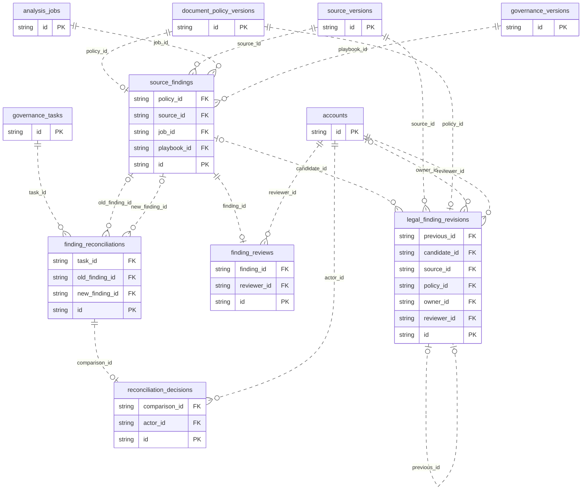

# Findings

Implemented model snapshot. This area owns 5 tables. Key-only parent tables provide cross-area context.

```mermaid
erDiagram
  accounts {
    string id PK
  }
  analysis_jobs {
    string id PK
  }
  document_policy_versions {
    string id PK
  }
  finding_reconciliations {
    string task_id FK
    string old_finding_id FK
    string new_finding_id FK
    string id PK
  }
  finding_reviews {
    string finding_id FK
    string reviewer_id FK
    string id PK
  }
  governance_tasks {
    string id PK
  }
  governance_versions {
    string id PK
  }
  legal_finding_revisions {
    string previous_id FK
    string candidate_id FK
    string source_id FK
    string policy_id FK
    string owner_id FK
    string reviewer_id FK
    string id PK
  }
  reconciliation_decisions {
    string comparison_id FK
    string actor_id FK
    string id PK
  }
  source_findings {
    string policy_id FK
    string source_id FK
    string job_id FK
    string playbook_id FK
    string id PK
  }
  source_versions {
    string id PK
  }
  governance_tasks ||..o{ finding_reconciliations : "task_id"
  source_findings |o..o{ finding_reconciliations : "old_finding_id"
  source_findings |o..o{ finding_reconciliations : "new_finding_id"
  source_findings ||..o| finding_reviews : "finding_id"
  accounts ||..o{ finding_reviews : "reviewer_id"
  legal_finding_revisions |o..o| legal_finding_revisions : "previous_id"
  source_findings |o..o{ legal_finding_revisions : "candidate_id"
  source_versions ||..o{ legal_finding_revisions : "source_id"
  document_policy_versions ||..o| legal_finding_revisions : "policy_id"
  accounts |o..o{ legal_finding_revisions : "owner_id"
  accounts ||..o{ legal_finding_revisions : "reviewer_id"
  finding_reconciliations ||..o| reconciliation_decisions : "comparison_id"
  accounts ||..o{ reconciliation_decisions : "actor_id"
  document_policy_versions ||..o| source_findings : "policy_id"
  source_versions ||..o{ source_findings : "source_id"
  analysis_jobs ||..o{ source_findings : "job_id"
  governance_versions ||..o{ source_findings : "playbook_id"
```

[Editable Mermaid](03_findings.mmd) · [All data views](../README.md)
