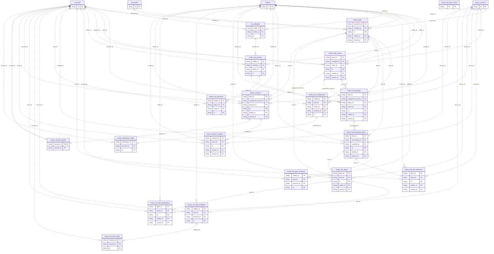

# Review Work

Implemented model snapshot. This area owns 19 tables. Key-only parent tables provide cross-area context.

```mermaid
erDiagram
  accounts {
    string id PK
  }
  documents {
    string id PK
  }
  matters {
    string id PK
  }
  review_notification_reads {
    string notification_id FK
    string account_id FK
    string id PK
  }
  review_session_leases {
    string account_id PK, FK
    string session_id FK
  }
  review_session_receipts {
    string session_id FK
    string actor_id FK
    string id PK
    string matter_id FK
    string source_id FK
  }
  review_sessions {
    string task_id FK
    string assignment_event_id FK
    string account_id FK
    string id PK
    string matter_id FK
    string source_id FK
  }
  review_sla_alert_cursor {
    string id PK
  }
  review_sla_alert_dispositions {
    string alert_id FK
    string actor_id FK
    string id PK
    string matter_id FK
    string source_id FK
  }
  review_sla_alert_reads {
    string recipient_id FK
    string account_id FK
    string id PK
  }
  review_sla_alert_recipients {
    string matter_id FK
    string alert_id FK
    string account_id FK
    string id PK
  }
  review_sla_alerts {
    string plan_id FK
    string task_id FK
    string id PK
    string matter_id FK
    string source_id FK
  }
  review_sla_bindings {
    string task_id FK
    string assignment_event_id FK
    string policy_id FK
    string event_id FK
    string id PK
    string matter_id FK
    string source_id FK
  }
  review_sla_decisions {
    string matter_id FK
    string policy_id FK
    string actor_id FK
    string id PK
  }
  review_sla_escalation_plans {
    string task_id FK
    string sla_binding_id FK
    string created_by FK
    string id PK
    string matter_id FK
    string source_id FK
  }
  review_sla_plan_decisions {
    string plan_id FK
    string actor_id FK
    string id PK
    string matter_id FK
    string source_id FK
  }
  review_sla_plan_recipients {
    string matter_id FK
    string plan_id FK
    string account_id FK
    string id PK
  }
  review_sla_policies {
    string matter_id FK
    string calendar_id FK
    string author_id FK
    string id PK
  }
  review_task_events {
    string task_id FK
    string assignee_id FK
    string actor_id FK
    string id PK
    string matter_id FK
    string source_id FK
  }
  review_task_notifications {
    string matter_id FK
    string task_id FK
    string event_id FK
    string account_id FK
    string id PK
  }
  review_tasks {
    string document_id FK
    string created_by FK
    string id PK
    string matter_id FK
    string source_id FK
  }
  sla_calendars {
    string matter_id FK
    string author_id FK
    string id PK
  }
  source_versions {
    string id PK
  }
  review_task_notifications ||..o| review_notification_reads : "notification_id"
  accounts ||..o{ review_notification_reads : "account_id"
  accounts ||--o| review_session_leases : "account_id"
  review_sessions ||..o| review_session_leases : "session_id"
  review_sessions ||..o{ review_session_receipts : "session_id"
  accounts ||..o{ review_session_receipts : "actor_id"
  matters ||..o{ review_session_receipts : "matter_id"
  source_versions ||..o{ review_session_receipts : "source_id"
  review_tasks ||..o{ review_sessions : "task_id"
  review_task_events ||..o{ review_sessions : "assignment_event_id"
  accounts ||..o{ review_sessions : "account_id"
  matters ||..o{ review_sessions : "matter_id"
  source_versions ||..o{ review_sessions : "source_id"
  review_sla_alerts ||..o{ review_sla_alert_dispositions : "alert_id"
  accounts ||..o{ review_sla_alert_dispositions : "actor_id"
  matters ||..o{ review_sla_alert_dispositions : "matter_id"
  source_versions ||..o{ review_sla_alert_dispositions : "source_id"
  review_sla_alert_recipients ||..o| review_sla_alert_reads : "recipient_id"
  accounts ||..o{ review_sla_alert_reads : "account_id"
  matters ||..o{ review_sla_alert_recipients : "matter_id"
  review_sla_alerts ||..o{ review_sla_alert_recipients : "alert_id"
  accounts ||..o{ review_sla_alert_recipients : "account_id"
  review_sla_escalation_plans ||..o{ review_sla_alerts : "plan_id"
  review_tasks ||..o{ review_sla_alerts : "task_id"
  matters ||..o{ review_sla_alerts : "matter_id"
  source_versions ||..o{ review_sla_alerts : "source_id"
  review_tasks ||..o{ review_sla_bindings : "task_id"
  review_task_events ||..o{ review_sla_bindings : "assignment_event_id"
  review_sla_policies ||..o{ review_sla_bindings : "policy_id"
  review_task_events ||..o{ review_sla_bindings : "event_id"
  matters ||..o{ review_sla_bindings : "matter_id"
  source_versions ||..o{ review_sla_bindings : "source_id"
  matters ||..o{ review_sla_decisions : "matter_id"
  review_sla_policies ||..o{ review_sla_decisions : "policy_id"
  accounts ||..o{ review_sla_decisions : "actor_id"
  review_tasks ||..o{ review_sla_escalation_plans : "task_id"
  review_sla_bindings ||..o{ review_sla_escalation_plans : "sla_binding_id"
  accounts ||..o{ review_sla_escalation_plans : "created_by"
  matters ||..o{ review_sla_escalation_plans : "matter_id"
  source_versions ||..o{ review_sla_escalation_plans : "source_id"
  review_sla_escalation_plans ||..o| review_sla_plan_decisions : "plan_id"
  accounts ||..o{ review_sla_plan_decisions : "actor_id"
  matters ||..o{ review_sla_plan_decisions : "matter_id"
  source_versions ||..o{ review_sla_plan_decisions : "source_id"
  matters ||..o{ review_sla_plan_recipients : "matter_id"
  review_sla_escalation_plans ||..o{ review_sla_plan_recipients : "plan_id"
  accounts ||..o{ review_sla_plan_recipients : "account_id"
  matters ||..o{ review_sla_policies : "matter_id"
  sla_calendars ||..o{ review_sla_policies : "calendar_id"
  accounts ||..o{ review_sla_policies : "author_id"
  review_tasks ||..o{ review_task_events : "task_id"
  accounts ||..o{ review_task_events : "assignee_id"
  accounts ||..o{ review_task_events : "actor_id"
  matters ||..o{ review_task_events : "matter_id"
  source_versions ||..o{ review_task_events : "source_id"
  matters ||..o{ review_task_notifications : "matter_id"
  review_tasks ||..o{ review_task_notifications : "task_id"
  review_task_events ||..o{ review_task_notifications : "event_id"
  accounts ||..o{ review_task_notifications : "account_id"
  documents ||..o{ review_tasks : "document_id"
  accounts ||..o{ review_tasks : "created_by"
  matters ||..o{ review_tasks : "matter_id"
  source_versions ||..o{ review_tasks : "source_id"
  matters ||..o{ sla_calendars : "matter_id"
  accounts ||..o{ sla_calendars : "author_id"
```

[Editable Mermaid](04_review_work.mmd) · [All data views](../README.md)
