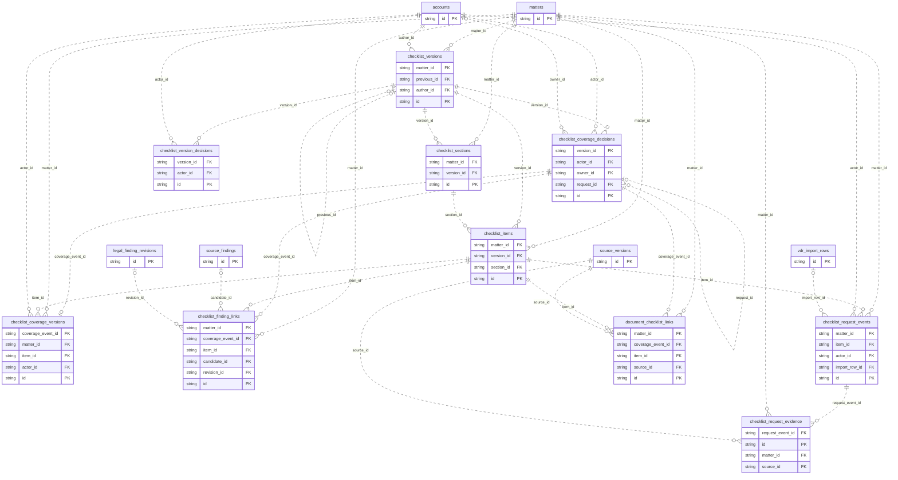

# Checklists

Implemented model snapshot. This area owns 10 tables. Key-only parent tables provide cross-area context.

```mermaid
erDiagram
  accounts {
    string id PK
  }
  checklist_coverage_decisions {
    string version_id FK
    string actor_id FK
    string owner_id FK
    string request_id FK
    string id PK
  }
  checklist_coverage_versions {
    string coverage_event_id FK
    string matter_id FK
    string item_id FK
    string actor_id FK
    string id PK
  }
  checklist_finding_links {
    string matter_id FK
    string coverage_event_id FK
    string item_id FK
    string candidate_id FK
    string revision_id FK
    string id PK
  }
  checklist_items {
    string matter_id FK
    string version_id FK
    string section_id FK
    string id PK
  }
  checklist_request_events {
    string matter_id FK
    string item_id FK
    string actor_id FK
    string import_row_id FK
    string id PK
  }
  checklist_request_evidence {
    string request_event_id FK
    string id PK
    string matter_id FK
    string source_id FK
  }
  checklist_sections {
    string matter_id FK
    string version_id FK
    string id PK
  }
  checklist_version_decisions {
    string version_id FK
    string actor_id FK
    string id PK
  }
  checklist_versions {
    string matter_id FK
    string previous_id FK
    string author_id FK
    string id PK
  }
  document_checklist_links {
    string matter_id FK
    string coverage_event_id FK
    string item_id FK
    string source_id FK
    string id PK
  }
  legal_finding_revisions {
    string id PK
  }
  matters {
    string id PK
  }
  source_findings {
    string id PK
  }
  source_versions {
    string id PK
  }
  vdr_import_rows {
    string id PK
  }
  checklist_versions ||..o{ checklist_coverage_decisions : "version_id"
  accounts ||..o{ checklist_coverage_decisions : "actor_id"
  accounts |o..o{ checklist_coverage_decisions : "owner_id"
  checklist_coverage_decisions |o..o{ checklist_coverage_decisions : "request_id"
  checklist_coverage_decisions ||..o| checklist_coverage_versions : "coverage_event_id"
  matters ||..o{ checklist_coverage_versions : "matter_id"
  checklist_items ||..o{ checklist_coverage_versions : "item_id"
  accounts ||..o{ checklist_coverage_versions : "actor_id"
  matters ||..o{ checklist_finding_links : "matter_id"
  checklist_coverage_decisions ||..o{ checklist_finding_links : "coverage_event_id"
  checklist_items ||..o{ checklist_finding_links : "item_id"
  source_findings |o..o{ checklist_finding_links : "candidate_id"
  legal_finding_revisions |o..o{ checklist_finding_links : "revision_id"
  matters ||..o{ checklist_items : "matter_id"
  checklist_versions ||..o{ checklist_items : "version_id"
  checklist_sections ||..o{ checklist_items : "section_id"
  matters ||..o{ checklist_request_events : "matter_id"
  checklist_items ||..o{ checklist_request_events : "item_id"
  accounts ||..o{ checklist_request_events : "actor_id"
  vdr_import_rows |o..o{ checklist_request_events : "import_row_id"
  checklist_request_events ||..o{ checklist_request_evidence : "request_event_id"
  matters ||..o{ checklist_request_evidence : "matter_id"
  source_versions ||..o{ checklist_request_evidence : "source_id"
  matters ||..o{ checklist_sections : "matter_id"
  checklist_versions ||..o{ checklist_sections : "version_id"
  checklist_versions ||..o{ checklist_version_decisions : "version_id"
  accounts ||..o{ checklist_version_decisions : "actor_id"
  matters ||..o{ checklist_versions : "matter_id"
  checklist_versions |o..o{ checklist_versions : "previous_id"
  accounts ||..o{ checklist_versions : "author_id"
  matters ||..o{ document_checklist_links : "matter_id"
  checklist_coverage_decisions ||..o{ document_checklist_links : "coverage_event_id"
  checklist_items ||..o{ document_checklist_links : "item_id"
  source_versions ||..o{ document_checklist_links : "source_id"
```

[Editable Mermaid](05_checklists.mmd) · [All data views](../README.md)
