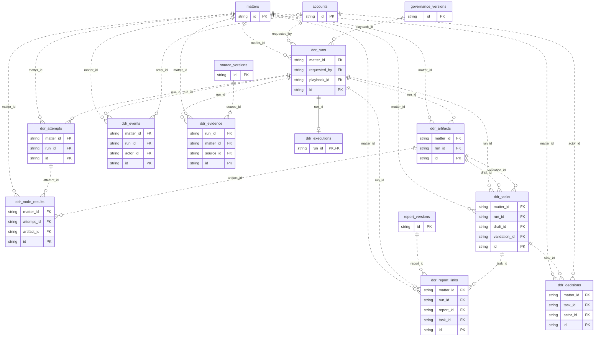

# Ddr Execution

Implemented model snapshot. This area owns 10 tables. Key-only parent tables provide cross-area context.

```mermaid
erDiagram
  accounts {
    string id PK
  }
  ddr_artifacts {
    string matter_id FK
    string run_id FK
    string id PK
  }
  ddr_attempts {
    string matter_id FK
    string run_id FK
    string id PK
  }
  ddr_decisions {
    string matter_id FK
    string task_id FK
    string actor_id FK
    string id PK
  }
  ddr_events {
    string matter_id FK
    string run_id FK
    string actor_id FK
    string id PK
  }
  ddr_evidence {
    string run_id FK
    string matter_id FK
    string source_id FK
    string id PK
  }
  ddr_executions {
    string run_id PK, FK
  }
  ddr_node_results {
    string matter_id FK
    string attempt_id FK
    string artifact_id FK
    string id PK
  }
  ddr_report_links {
    string matter_id FK
    string run_id FK
    string report_id FK
    string task_id FK
    string id PK
  }
  ddr_runs {
    string matter_id FK
    string requested_by FK
    string playbook_id FK
    string id PK
  }
  ddr_tasks {
    string matter_id FK
    string run_id FK
    string draft_id FK
    string validation_id FK
    string id PK
  }
  governance_versions {
    string id PK
  }
  matters {
    string id PK
  }
  report_versions {
    string id PK
  }
  source_versions {
    string id PK
  }
  matters ||..o{ ddr_artifacts : "matter_id"
  ddr_runs ||..o{ ddr_artifacts : "run_id"
  matters ||..o{ ddr_attempts : "matter_id"
  ddr_runs ||..o{ ddr_attempts : "run_id"
  matters ||..o{ ddr_decisions : "matter_id"
  ddr_tasks ||..o{ ddr_decisions : "task_id"
  accounts ||..o{ ddr_decisions : "actor_id"
  matters ||..o{ ddr_events : "matter_id"
  ddr_runs ||..o{ ddr_events : "run_id"
  accounts |o..o{ ddr_events : "actor_id"
  ddr_runs ||..o{ ddr_evidence : "run_id"
  matters ||..o{ ddr_evidence : "matter_id"
  source_versions ||..o{ ddr_evidence : "source_id"
  ddr_runs ||--o| ddr_executions : "run_id"
  matters ||..o{ ddr_node_results : "matter_id"
  ddr_attempts ||..o{ ddr_node_results : "attempt_id"
  ddr_artifacts ||..o{ ddr_node_results : "artifact_id"
  matters ||..o{ ddr_report_links : "matter_id"
  ddr_runs ||..o{ ddr_report_links : "run_id"
  report_versions ||..o{ ddr_report_links : "report_id"
  ddr_tasks ||..o{ ddr_report_links : "task_id"
  matters ||..o{ ddr_runs : "matter_id"
  accounts ||..o{ ddr_runs : "requested_by"
  governance_versions ||..o{ ddr_runs : "playbook_id"
  matters ||..o{ ddr_tasks : "matter_id"
  ddr_runs ||..o{ ddr_tasks : "run_id"
  ddr_artifacts ||..o{ ddr_tasks : "draft_id"
  ddr_artifacts ||..o{ ddr_tasks : "validation_id"
```

[Editable Mermaid](08_ddr_execution.mmd) · [All data views](../README.md)
