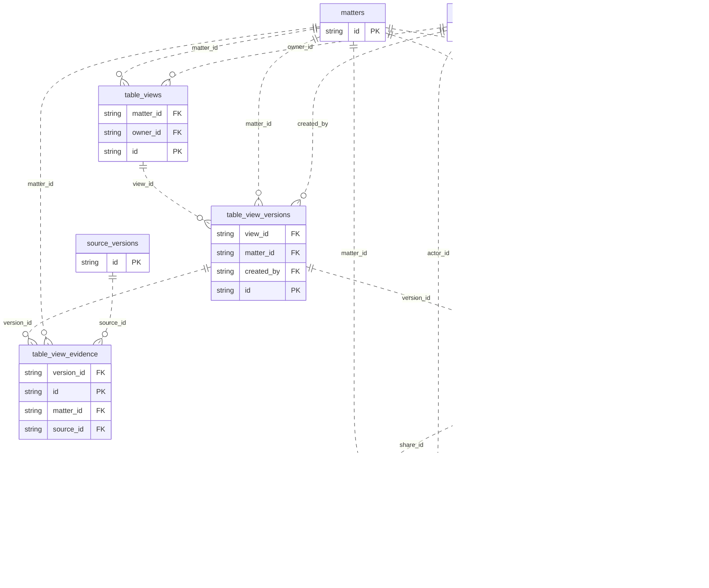

# Saved Views

Implemented model snapshot. This area owns 6 tables. Key-only parent tables provide cross-area context.

```mermaid
erDiagram
  accounts {
    string id PK
  }
  matters {
    string id PK
  }
  source_versions {
    string id PK
  }
  table_view_evidence {
    string version_id FK
    string id PK
    string matter_id FK
    string source_id FK
  }
  table_view_share_decisions {
    string matter_id FK
    string share_id FK
    string actor_id FK
    string id PK
  }
  table_view_share_recipients {
    string matter_id FK
    string share_id FK
    string account_id FK
    string id PK
  }
  table_view_shares {
    string matter_id FK
    string version_id FK
    string requested_by FK
    string id PK
  }
  table_view_versions {
    string view_id FK
    string matter_id FK
    string created_by FK
    string id PK
  }
  table_views {
    string matter_id FK
    string owner_id FK
    string id PK
  }
  table_view_versions ||..o{ table_view_evidence : "version_id"
  matters ||..o{ table_view_evidence : "matter_id"
  source_versions ||..o{ table_view_evidence : "source_id"
  matters ||..o{ table_view_share_decisions : "matter_id"
  table_view_shares ||..o{ table_view_share_decisions : "share_id"
  accounts ||..o{ table_view_share_decisions : "actor_id"
  matters ||..o{ table_view_share_recipients : "matter_id"
  table_view_shares ||..o{ table_view_share_recipients : "share_id"
  accounts ||..o{ table_view_share_recipients : "account_id"
  matters ||..o{ table_view_shares : "matter_id"
  table_view_versions ||..o{ table_view_shares : "version_id"
  accounts ||..o{ table_view_shares : "requested_by"
  table_views ||..o{ table_view_versions : "view_id"
  matters ||..o{ table_view_versions : "matter_id"
  accounts ||..o{ table_view_versions : "created_by"
  matters ||..o{ table_views : "matter_id"
  accounts ||..o{ table_views : "owner_id"
```

[Editable Mermaid](11_saved_views.mmd) · [All data views](../README.md)
