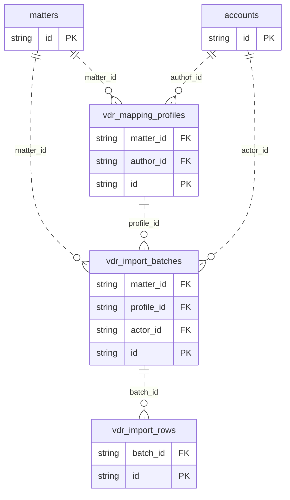

# Vdr Intake

Implemented model snapshot. This area owns 3 tables. Key-only parent tables provide cross-area context.

```mermaid
erDiagram
  accounts {
    string id PK
  }
  matters {
    string id PK
  }
  vdr_import_batches {
    string matter_id FK
    string profile_id FK
    string actor_id FK
    string id PK
  }
  vdr_import_rows {
    string batch_id FK
    string id PK
  }
  vdr_mapping_profiles {
    string matter_id FK
    string author_id FK
    string id PK
  }
  matters ||..o{ vdr_import_batches : "matter_id"
  vdr_mapping_profiles ||..o{ vdr_import_batches : "profile_id"
  accounts ||..o{ vdr_import_batches : "actor_id"
  vdr_import_batches ||..o{ vdr_import_rows : "batch_id"
  matters ||..o{ vdr_mapping_profiles : "matter_id"
  accounts ||..o{ vdr_mapping_profiles : "author_id"
```

[Editable Mermaid](13_vdr_intake.mmd) · [All data views](../README.md)
